# ☁️ Azure Hub-and-Spoke Networking Lab (NSGs, Peering, Break/Fix, Private Endpoint) 🚦🔒

## 📘 Overview
This lab walks through a **cloud-engineer-style** build of a secure Azure network using a **hub-and-spoke** topology. You will:
- Build VNets + subnets
- Apply NSGs at **subnet + NIC** layers
- Configure inbound/outbound rules
- Perform **break/fix** troubleshooting
- Configure **VNet peering** and validate **non-transitive** behavior
- Compare **Load Balancer vs Application Gateway**
- Configure a **Private Endpoint** + **Private DNS**, and validate private resolution
- Click this link with the set up of this envirnment using Terraform https://github.com/zauger1217-commits/azure-hub-spoke-terraform/tree/main

---

## 🧱 Architecture
### High-level topology (Hub-and-Spoke)

```mermaid
flowchart LR
  subgraph HUB["🛡️ vnet-hub (10.10.0.0/16)"]
    HW["🧩 snet-workload (10.10.1.0/24)\n🔒 NSG: nsg-workload (subnet)"]
    HPE["🔐 snet-private-endpoints (10.10.2.0/24)\n(Private Endpoint subnet)"]
    HVM["🖥️ vm-workload-01\n🔒 NSG: nsg-workload (NIC)"]
    HW --> HVM
  end

  subgraph SA["🛰️ vnet-spoke-a (10.20.0.0/16)"]
    SAW["🧩 snet-spoke-a (10.20.1.0/24)\n🔒 NSG: nsg-workload (subnet)"]
    SAVM["🖥️ vm-spoke-a-01\n🔒 NSG: nsg-workload (NIC)"]
    SAW --> SAVM
  end

  subgraph SB["🛰️ vnet-spoke-b (10.30.0.0/16)"]
    SBW["🧩 snet-spoke-b (10.30.1.0/24)\n🔒 NSG: nsg-workload (subnet)"]
    SBVM["🖥️ vm-spoke-b-01\n🔒 NSG: nsg-workload (NIC)"]
    SBW --> SBVM
  end

  SA <--> |🔁 VNet Peering| HUB
  SB <--> |🔁 VNet Peering| HUB
  SAVM -. ❌ Non-transitive .-> SBVM

  PE["🔒 Private Endpoint (PE)\nStorage Blob"] --> HPE
```


---

## 🗂️ Resource Organization (Real-world ownership)
### Resource Groups
- **`networking-rg`** 🧭  
  - VNets, subnets, NSGs, peerings, private endpoint, Private DNS zone
- **`compute-rg`** 🖥️  
  - VMs, NICs, disks, (optional) public IPs

> ✅ Resource Groups are **management containers**, not traffic/security boundaries.

---

## 🧩 Naming + Address Plan
### VNets
- `vnet-hub` → `10.10.0.0/16`
- `vnet-spoke-a` → `10.20.0.0/16`
- `vnet-spoke-b` → `10.30.0.0/16`

### Subnets
- Hub:
  - `snet-workload` → `10.10.1.0/24`
  - `snet-private-endpoints` → `10.10.2.0/24`
- Spoke A:
  - `snet-spoke-a` → `10.20.1.0/24`
- Spoke B:
  - `snet-spoke-b` → `10.30.1.0/24`

### NSG
- `nsg-workload` (centralized baseline)

### VMs
- Hub: `vm-workload-01`
- Spoke A: `vm-spoke-a-01`
- Spoke B: `vm-spoke-b-01`

---

# 🧭 Phase-by-Phase Instructions (Step-by-step)

## Phase 1 — Core Networking 🧱🌐
### 1.1 Create Resource Groups
**Portal:** Resource groups → Create  
Create:
- `networking-rg`
- `compute-rg`

### 1.2 Create Hub VNet + Subnets
**Portal:** Virtual networks → Create  
- RG: `networking-rg`
- Name: `vnet-hub`
- Address space: `10.10.0.0/16`

**Portal:** vnet-hub → Subnets → + Subnet  
Create:
- `snet-workload` (`10.10.1.0/24`)
- `snet-private-endpoints` (`10.10.2.0/24`)

### 1.3 Create NSG
**Portal:** Network security groups → Create  
- RG: `networking-rg`
- Name: `nsg-workload`

### 1.4 Associate NSG to Hub Subnet
**Portal:** vnet-hub → Subnets → snet-workload  
- Network security group: `nsg-workload` → Save ✅

---

## Phase 2 — Deploy Hub VM + Secure Access 🖥️🔒
### 2.1 Create Hub VM
**Portal:** Virtual machines → Create  
- RG: `compute-rg`
- Name: `vm-workload-01`
- VNet: `vnet-hub`
- Subnet: `snet-workload`
- Public IP: Create (for initial access)
- Networking: **Public inbound ports = None**, **NIC NSG = None** (we apply NSG manually)

### 2.2 Associate NSG to Hub VM NIC
**Portal:** vm-workload-01 → Networking → Network settings → NIC → Network security group  
- Select `nsg-workload` → Save ✅

### 2.3 Add inbound RDP rule (scoped to your public IP)
**Portal:** nsg-workload → Inbound security rules → + Add  
- Service: RDP (3389)
- Source: **Your public IP**
- Action: Allow
- Priority: 100
- Name: `Allow-RDP-MyIP`

### 2.4 Validate connectivity ✅
- VM → Overview → copy **Public IP**
- From your computer: RDP to Public IP
- Expected: **RDP works only from your IP**

---

## Phase 3 — Outbound Rules + Break/Fix 🧪🧯
### 3.1 Break outbound (deny internet)
**Portal:** nsg-workload → Outbound security rules → + Add  
- Destination: Service tag → `Internet`
- Action: Deny
- Priority: 200
- Name: `Deny-Internet-Outbound`

### 3.2 Test from Hub VM
RDP to `vm-workload-01` and run:
```powershell
nslookup microsoft.com
```
Expected: ❌ Fails (outbound blocked)

### 3.3 Fix outbound
- Remove/disable `Deny-Internet-Outbound`
- Retest `nslookup microsoft.com`
Expected: ✅ Works

---

## Phase 4 — Spokes + VNet Peering 🔁🛰️
### 4.1 Create Spoke VNets
**Portal:** Virtual networks → Create  
RG: `networking-rg`

**Spoke A**
- Name: `vnet-spoke-a`
- Address space: `10.20.0.0/16`
- Subnet: `snet-spoke-a` (`10.20.1.0/24`)

**Spoke B**
- Name: `vnet-spoke-b`
- Address space: `10.30.0.0/16`
- Subnet: `snet-spoke-b` (`10.30.1.0/24`)

### 4.2 Create Hub ↔ Spoke peerings
**Portal:** vnet-hub → Peerings → + Add  
For each spoke:
- Allow VNet access: ✅ Enabled
- Allow forwarded traffic: ❌ Disabled
- Gateway transit / remote gateways: ❌ Disabled

### 4.3 Deploy spoke VMs
**Portal:** Virtual machines → Create  
- RG: `compute-rg`
- Spoke A VM: `vm-spoke-a-01` in `vnet-spoke-a / snet-spoke-a`
- Spoke B VM: `vm-spoke-b-01` in `vnet-spoke-b / snet-spoke-b`
> 💡 For this lab, we used the hub VM as a jump point, so public IPs on spokes are optional.

### 4.4 Centralize security: attach the same NSG everywhere (lab choice)
- Attach `nsg-workload` to:
  - `vnet-hub / snet-workload`
  - `vnet-spoke-a / snet-spoke-a`
  - `vnet-spoke-b / snet-spoke-b`
- Attach `nsg-workload` to NICs:
  - hub NIC, spoke-a NIC, spoke-b NIC

### 4.5 Test peered traffic (success)
From `vm-spoke-a-01` → RDP to Hub VM **private IP** (`10.10.1.x`) ✅

### 4.6 Validate **non-transitive** peering (expected fail)
Try `vm-spoke-a-01` → RDP to Spoke B VM private IP (`10.30.1.x`)  
Expected: ❌ Fails (no transitive routing)

---

## Phase 5 — Load Balancer vs Application Gateway ⚖️
| Feature | Azure Load Balancer | Application Gateway |
|---|---|---|
| OSI Layer | L4 (TCP/UDP) | L7 (HTTP/HTTPS) |
| TLS Termination | ❌ | ✅ |
| WAF | ❌ | ✅ |
| Path-based routing | ❌ | ✅ |
| Best for | Internal services, HA ports | Web apps, HTTP routing, WAF |

**Decision note:** Use **Load Balancer** for L4 service distribution; use **App Gateway** for web apps requiring L7 routing and WAF.

---

## Phase 6 — Private Endpoint + Private DNS 🔐🧬
### 6.1 Create Storage Account (example)
**Portal:** Storage accounts → Create  
- RG: `networking-rg` (or a dedicated PaaS RG)
- Name: `stprivatelab01` (example)
- Region: same as hub/spokes

### 6.2 Create Private Endpoint (in networking-rg)
**Portal:** Storage account → Networking → Private endpoint connections → + Private endpoint  
- RG: `networking-rg`
- Name: `pe-storage-hub`
- VNet: `vnet-hub`
- Subnet: `snet-private-endpoints`
- Sub-resource: `blob`
- Private DNS integration: ✅ Enabled

### 6.3 Validate DNS resolution from the **Hub VM**
On **vm-workload-01**:
```powershell
ipconfig /flushdns
nslookup stprivatelab01.blob.core.windows.net
```

✅ Expected:
- Resolves to **10.x.x.x** (private IP)
- Alias includes `privatelink.blob.core.windows.net`

> ⚠️ Testing from a spoke VM may still return a **public IP** if the Private DNS zone isn’t linked to that spoke VNet (VNet-scoped DNS behavior).

---

# 🧯 Issues We Hit (and Fixes) 🛠️

## 1) RDP failed initially ❌
**Cause:** NSG inbound rule Source IP should be **your public IP**, not the VM’s IP.  
**Fix:** Set inbound RDP rule source to your **client public IP**.

## 2) Azure auto-created NSGs/subnets in spokes 🧩
**Cause:** Azure VM creation wizard sometimes auto-creates a default NSG/subnet for baseline security.  
**Fix:** Verify the VM is in the intended subnet, attach `nsg-workload` to the subnet/NIC, and delete unused auto-created resources.

## 3) DNS lookup typo for Blob ❌
**Cause:** Entered `blolb` instead of `blob`.  
**Fix:** Use: `stprivatelab01.blob.core.windows.net`

## 4) Private Endpoint DNS appeared “wrong” 🧠
**Cause:** `nslookup` was run from the **spoke VM**, not the **hub VM** linked to the Private DNS zone.  
**Fix:** Run `nslookup` from **vm-workload-01** (hub), then confirm it resolves to **10.x**.

---

# ✅ Skills Demonstrated 🧠💼
- Hub-and-spoke network design in Azure
- Subnet design + IP planning
- NSG creation, association (subnet + NIC), rule design (inbound/outbound)
- Break/fix troubleshooting using effective security reasoning
- VNet peering configuration and validation
- Non-transitive routing validation
- Private Endpoint deployment + Private DNS resolution validation
- Clear operational documentation for repeatability

---

# 🧹 Cleanup (Cost Control) 🧽
Delete resource groups when finished:
- `compute-rg` (VMs + disks + NICs)
- `networking-rg` (VNets + NSGs + peering + PE + DNS)

> Tip: Always confirm no required resources remain before deleting.
